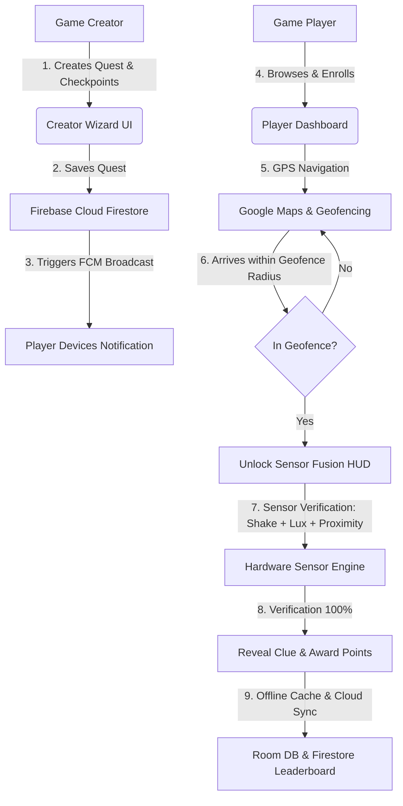

# Campus Quest 🎓📱🗺️

> **A Next-Generation Location-Aware, Gamified Campus Exploration & Quest Platform for Android**

---

## 🌟 Overview

**Campus Quest** is an enterprise-grade, native Android application engineered in **Kotlin** that transforms university campuses into interactive, gamified adventure arenas. The platform operates on a **Dual-Role Model**:

1. **Game Creators** design custom campus quests, define dynamic GPS checkpoint boundaries, set environmental unlock conditions, configure sensor fusion puzzles, and broadcast quest alerts.
2. **Game Players** discover and enroll in quests, navigate campus grounds using interactive Google Maps, enter geofenced zones, and solve multi-sensor hardware challenges (accelerometer, ambient light, proximity) to unlock clues, climb live leaderboards, and earn achievements.

---

## 🏗️ Architecture & Technology Stack

- **Platform & Language:** Native Android (API 26+ / Android 8.0 to Android 14+), Kotlin 1.9+, Coroutines & Flow
- **Architecture Pattern:** Clean Architecture + MVVM (Model-View-ViewModel) + Repository Pattern
- **UI & Presentation:** Material Design 3 (MD3), Jetpack Navigation Component, Single-Activity Architecture, CameraX & Custom Scan HUD
- **Location & Mapping:** Google Play Services Location API (`FusedLocationProviderClient`), Google Maps Android SDK, Geofencing API
- **Sensor Engine:** Android Sensor Framework (`SensorManager`) — Multi-sensor fusion combining 3-axis Accelerometer, Ambient Light Sensor, and Proximity Gate
- **Local Persistence:** Jetpack Room ORM (SQLite) with TypeConverters, SQLite Transactions, and Offline Mutation Sync Queue
- **Cloud Backend & Realtime:** Firebase Suite — Firebase Authentication, Cloud Firestore (Real-time Snapshots & Offline Cache), Cloud Storage, and Firebase Cloud Messaging (FCM)
- **Dependency Injection & Async:** Modern Kotlin Coroutines (`StateFlow`, `SharedFlow`), WorkManager for background sync

---

## 👥 6-Member Responsibility Split

| Member | Handles | Responsibility in the Game | Associated Workplan Document |
| :--- | :--- | :--- | :--- |
| **M1** | **Player UI & Navigation** | Handles what the **player sees and navigates through** — Login, Games list, Game Details, Join Game, Map/Gameplay navigation, Leaderboard, common UI and navigation. | 📄 [Member1_UI_UX_NAVIGATION_WORKPLAN.md](./documentation/Member1_UI_UX_NAVIGATION_WORKPLAN.md) |
| **M2** | **Creator & Game Management** | Handles the **game creator side** — Create Game, add/edit checkpoints, set clues/lore/location/settings, save drafts, and publish games. | 📄 [Member2_QUEST_SCAN_UI_WORKPLAN.md](./documentation/Member2_QUEST_SCAN_UI_WORKPLAN.md) |
| **M3** | **Location + Sensors + Fusion** | Handles the **physical detection system** — GPS, map location, geofencing, distance, accelerometer, light sensor, motion detection, fusion calculation, and proximity verification. | 📄 [Member3_LOCATION_GEOFENCING_WORKPLAN.md](./documentation/Member3_LOCATION_GEOFENCING_WORKPLAN.md) |
| **M4** | **Quest & Scan Gameplay** | Handles the **actual checkpoint discovery experience** — checkpoint screen, scan interface, fusion meter, scanning states, success/failure, and reveal of the discovered checkpoint/relic. | 📄 [Member4_SENSOR_FUSION_WORKPLAN.md](./documentation/Member4_SENSOR_FUSION_WORKPLAN.md) |
| **M5** | **Firebase & Backend** | Handles the **online/shared data** — Firebase Auth, Firestore games/checkpoints/players/progress, game-specific leaderboards, security rules, and new-game FCM notifications. | 📄 [Member5_FIREBASE_CLOUD_SYNC_WORKPLAN.md](./documentation/Member5_FIREBASE_CLOUD_SYNC_WORKPLAN.md) |
| **M6** | **Room + Repository + Sync** | Handles the **local data and connection between systems** — Room database, DAOs, local cache, Repository layer, offline storage, pending sync, Firebase↔Room synchronization, and overall integration. | 📄 [Member6_ROOM_DATA_INTEGRATION_WORKPLAN.md](./documentation/Member6_ROOM_DATA_INTEGRATION_WORKPLAN.md) |

---

## 📚 Project Documentation Catalog

The project contains complete, production-ready specifications organized into the following categories:

```
campus-quest/
└── documentation/
    ├── 00_MASTER_DEVELOPMENT_PLAN.md
    ├── PRD_CAMPUS_QUEST.md
    ├── TRD_CAMPUS_QUEST.md
    ├── UI_UX_DESIGN_SPECIFICATION_CAMPUS_QUEST.md
    ├── APP_FLOW_DOCUMENT_CAMPUS_QUEST.md
    ├── Member1_UI_UX_NAVIGATION_WORKPLAN.md
    ├── Member2_QUEST_SCAN_UI_WORKPLAN.md
    ├── Member3_LOCATION_GEOFENCING_WORKPLAN.md
    ├── Member4_SENSOR_FUSION_WORKPLAN.md
    ├── Member5_FIREBASE_CLOUD_SYNC_WORKPLAN.md
    ├── Member6_ROOM_DATA_INTEGRATION_WORKPLAN.md
    ├── FIREBASE_SCHEMA_ENDPOINTS_AND_SECURITY.md
    ├── SENSOR_FUSION_AND_LOCATION_TECHNICAL_SPECIFICATION.md
    ├── SHARED_CONTRACTS_AND_INTEGRATION_INTERFACES.md
    ├── MOCK_DATA_CATALOG_AND_SEED_DATA_SPECIFICATION.md
    ├── INTEGRATION_AND_HANDOFF_PLAN.md
    ├── INTEGRATION_HANDOFF_AND_MILESTONE_PLAN.md
    ├── TESTING_AND_ACCEPTANCE_STRATEGY.md
    └── GIT_CHANGE_CONTROL_AND_TEAM_DEVELOPMENT_WORKFLOW.md
```

---

### 1. 🏛️ Master Blueprints & Product Requirements
*High-level strategy, product roadmaps, requirements specifications, and architectural foundations.*

| Document | Description |
| :--- | :--- |
| 📄 [00_MASTER_DEVELOPMENT_PLAN.md](./documentation/00_MASTER_DEVELOPMENT_PLAN.md) | **Master Development & Architecture Plan** — Complete multi-member execution blueprint, system topology, package layout, and milestone delivery roadmap. |
| 📄 [PRD_CAMPUS_QUEST.md](./documentation/PRD_CAMPUS_QUEST.md) | **Product Requirements Document (PRD)** — User personas, functional/non-functional requirements, game creator & player mechanics, acceptance criteria. |
| 📄 [TRD_CAMPUS_QUEST.md](./documentation/TRD_CAMPUS_QUEST.md) | **Technical Requirements Document (TRD)** — Tech stack specifications, architectural constraints, database schemas, performance targets, and security posture. |

---

### 2. 👥 Member Workplans & Individual Role Assignments
*Dedicated, end-to-end implementation roadmaps, contracts, and deliverables for each engineering team member.*

| Member | Focus Area | Workplan Document | Key Responsibilities |
| :--- | :--- | :--- | :--- |
| **Member 1 (M1)** | **Player UI & Navigation** | 📄 [Member1_UI_UX_NAVIGATION_WORKPLAN.md](./documentation/Member1_UI_UX_NAVIGATION_WORKPLAN.md) | Login, Games list, Game Details, Join Game, Map/Gameplay navigation, Leaderboard, common UI and navigation. |
| **Member 2 (M2)** | **Creator & Game Management** | 📄 [Member2_QUEST_SCAN_UI_WORKPLAN.md](./documentation/Member2_QUEST_SCAN_UI_WORKPLAN.md) | Create Game, add/edit checkpoints, set clues/lore/location/settings, save drafts, and publish games. |
| **Member 3 (M3)** | **Location + Sensors + Fusion** | 📄 [Member3_LOCATION_GEOFENCING_WORKPLAN.md](./documentation/Member3_LOCATION_GEOFENCING_WORKPLAN.md) | GPS, map location, geofencing, distance, accelerometer, light sensor, motion detection, fusion calculation, and proximity verification. |
| **Member 4 (M4)** | **Quest & Scan Gameplay** | 📄 [Member4_SENSOR_FUSION_WORKPLAN.md](./documentation/Member4_SENSOR_FUSION_WORKPLAN.md) | Checkpoint screen, scan interface, fusion meter, scanning states, success/failure, and reveal of the discovered checkpoint/relic. |
| **Member 5 (M5)** | **Firebase & Backend** | 📄 [Member5_FIREBASE_CLOUD_SYNC_WORKPLAN.md](./documentation/Member5_FIREBASE_CLOUD_SYNC_WORKPLAN.md) | Firebase Auth, Firestore games/checkpoints/players/progress, game-specific leaderboards, security rules, and new-game FCM notifications. |
| **Member 6 (M6)** | **Room + Repository + Sync** | 📄 [Member6_ROOM_DATA_INTEGRATION_WORKPLAN.md](./documentation/Member6_ROOM_DATA_INTEGRATION_WORKPLAN.md) | Room database, DAOs, local cache, Repository layer, offline storage, pending sync, Firebase↔Room synchronization, and overall integration. |

---

### 3. 🎨 UI/UX & Presentation Documents
*Visual designs, screen flows, design tokens, component hierarchies, and user journey maps.*

| Document | Description |
| :--- | :--- |
| 📄 [UI_UX_DESIGN_SPECIFICATION_CAMPUS_QUEST.md](./documentation/UI_UX_DESIGN_SPECIFICATION_CAMPUS_QUEST.md) | **UI/UX Design Specification** — Material 3 theming (Emerald & Amber campus palette), typography scales, XML component guidelines, micro-interactions, and accessibility standards. |
| 📄 [APP_FLOW_DOCUMENT_CAMPUS_QUEST.md](./documentation/APP_FLOW_DOCUMENT_CAMPUS_QUEST.md) | **Application Flow & User Journey Document** — Step-by-step state diagrams and visual navigation flows for Game Creator authoring and Game Player quest progression. |

---

### 4. ⚙️ Technical Implementation & Backend Specifications
*Data models, interface contracts, cloud security rules, mathematical sensor algorithms, and seed data.*

| Document | Description |
| :--- | :--- |
| 📄 [FIREBASE_SCHEMA_ENDPOINTS_AND_SECURITY.md](./documentation/FIREBASE_SCHEMA_ENDPOINTS_AND_SECURITY.md) | **Firebase Architecture & Security Specification** — Firestore collection structures, granular security rules, FCM topic payload definitions, and Cloud Function triggers. |
| 📄 [SENSOR_FUSION_AND_LOCATION_TECHNICAL_SPECIFICATION.md](./documentation/SENSOR_FUSION_AND_LOCATION_TECHNICAL_SPECIFICATION.md) | **Sensor Fusion & Location Specification** — Low-pass filtering, vector magnitude math ($a_{net} = \sqrt{x^2 + y^2 + z^2}$), lux calibration, and GPS geofence transition math. |
| 📄 [SHARED_CONTRACTS_AND_INTEGRATION_INTERFACES.md](./documentation/SHARED_CONTRACTS_AND_INTEGRATION_INTERFACES.md) | **Shared Contracts & Domain Interfaces** — Immutable Kotlin data models, repository abstractions, Result/Resource wrappers, and inter-module event bus definitions. |
| 📄 [MOCK_DATA_CATALOG_AND_SEED_DATA_SPECIFICATION.md](./documentation/MOCK_DATA_CATALOG_AND_SEED_DATA_SPECIFICATION.md) | **Mock Data Catalog & Seed Specification** — Pre-populated campus quests, dynamic checkpoint fixtures, JSON test payloads, and Room database seeding scripts. |

---

### 5. 🧪 Integration, Quality Assurance & Team Governance
*Milestone handoff gates, automated test matrices, device compatibility profiles, and Git workflow rules.*

| Document | Description |
| :--- | :--- |
| 📄 [INTEGRATION_AND_HANDOFF_PLAN.md](./documentation/INTEGRATION_AND_HANDOFF_PLAN.md) | **System Integration & Handoff Plan** — End-to-end subsystem connection checklist, Mock-to-Real migration phases, integration test cases, and rollback procedures. |
| 📄 [INTEGRATION_HANDOFF_AND_MILESTONE_PLAN.md](./documentation/INTEGRATION_HANDOFF_AND_MILESTONE_PLAN.md) | **Milestone Delivery Roadmap** — Sprint schedules, milestone completion criteria, handoff gate deliverables, and team dependency timelines. |
| 📄 [TESTING_AND_ACCEPTANCE_STRATEGY.md](./documentation/TESTING_AND_ACCEPTANCE_STRATEGY.md) | **Testing & Acceptance Strategy** — Unit tests (JUnit/MockK), Instrumented UI tests (Espresso), physical device testing matrix (Pixel, Samsung, Xiaomi), and sensor verification suites. |
| 📄 [GIT_CHANGE_CONTROL_AND_TEAM_DEVELOPMENT_WORKFLOW.md](./documentation/GIT_CHANGE_CONTROL_AND_TEAM_DEVELOPMENT_WORKFLOW.md) | **Git Governance & Change Control** — Branching naming conventions (`feature/`, `fix/`), Pull Request reviews, commit message standards, CI/CD checks, and merge policies. |

---

## 🚀 Key Gameplay & Technical Features



1. **Dynamic Geofence Puzzles:** Creators dynamically place checkpoints on the map with adjustable radii (10m - 100m). Players must physically navigate to the checkpoint to trigger clue interactions.
2. **Tri-Sensor Fusion Engine:** Unlocking secret clues requires satisfying physical environmental criteria:
   - **Kinetic Action:** Accelerometer motion / shake gesture threshold ($a_{net} > 14.5 \text{ m/s}^2$).
   - **Ambient Illumination:** Light sensor checks for specific lux ranges (e.g., dark room $< 10 \text{ lux}$ vs outdoors $> 300 \text{ lux}$).
   - **Proximity Gate:** Optical sensor coverage ($< 1 \text{ cm}$) confirming physical presence.
3. **Offline-First Resilience:** Full gameplay continues uninterrupted in campus Wi-Fi dead zones through local Room caching and an automatic background sync queue with conflict resolution.
4. **Real-Time Push Notifications:** Immediate FCM push notifications broadcast new quest releases across campus.

---

## 👥 Engineering Team & Contact

Developed as part of the **Mobile Application Development** curriculum:

- **Member 1 (M1):** Player UI & Navigation — Login, Games list, Game Details, Join Game, Map/Gameplay navigation, Leaderboard, common UI and navigation.
- **Member 2 (M2):** Creator & Game Management — Create Game, add/edit checkpoints, set clues/lore/location/settings, save drafts, and publish games.
- **Member 3 (M3):** Location + Sensors + Fusion — GPS, map location, geofencing, distance, accelerometer, light sensor, motion detection, fusion calculation, and proximity verification.
- **Member 4 (M4):** Quest & Scan Gameplay — Checkpoint screen, scan interface, fusion meter, scanning states, success/failure, and reveal of the discovered checkpoint/relic.
- **Member 5 (M5):** Firebase & Backend — Firebase Auth, Firestore games/checkpoints/players/progress, game-specific leaderboards, security rules, and new-game FCM notifications.
- **Member 6 (M6):** Room + Repository + Sync — Room database, DAOs, local cache, Repository layer, offline storage, pending sync, Firebase↔Room synchronization, and overall integration.

---

## 📄 License

This project is licensed under the [MIT License](LICENSE).
